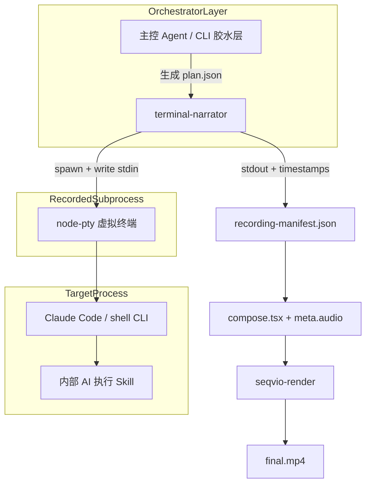

# Terminal Narrator 实施计划

> Coding Agent CLI 执行录屏 → 旁白讲解视频自动化  
> 包名：`@seqvio/terminal-narrator`  
> 范围：Phase 0 / Phase 1 / Phase 3（**不含 MCP 产品化入口**）

---

## 1. 目标

为 Seqvio 增加一条与 [`packages/browser-recorder`](packages/browser-recorder) 同构的终端演示管线：

```text
plan.json → record (node-pty) → recording-manifest.json → compose.tsx → seqvio-render → final.mp4
```

差异化在于 **narration-first**：捕获真实终端 I/O 后，按步骤生成旁白/字幕元数据，驱动 `TerminalDemo` 回放与高亮。

---

## 2. 包命名（已定）

| 项 | 名称 |
|----|------|
| npm 包 | `@seqvio/terminal-narrator` |
| CLI | `seqvio-terminal-narrator` / `seqvio-terminal` |
| 输出目录 | `output/terminal-narrator/<job-id>/` |

内部模块仍用动词命名（`record.ts`、`compose.ts`），与 browser-recorder 一致。

---

## 3. 核心架构：双层模式



**关键约束**：录制引擎必须在 PTY 之外，避免「Agent 录自己」的死循环。

---

## 4. 编排机制（本阶段采用）

| 机制 | 说明 | 本计划 |
|------|------|--------|
| 机制 1：外壳 Agent 模拟人类 | 主控向 PTY 写 `/my-skill` 等指令 | **采用（捕获层）** |
| 机制 2：MCP 沙盒重跑 | Claude Code 调用录屏工具 | **本阶段不做** |
| 机制 3：日志回放渲染 | 基于 manifest 加速回放 | **采用（渲染层）** |

---

## 5. 技术路线

**Phase 0**：`node-pty` 捕获 + timestamped manifest + **asciinema cast v2 导出**  
**Phase 1**：`TerminalDemo`（VHS 风格：渐变舞台 + macOS 窗框 + 打字机）+ Seqvio 渲染  
**Phase 3**：步骤摘要 → narration/captions → 可选 `--withAudio` TTS

机制 1 产品化入口：`record --sample-claude --skill "/my-skill ..."`（外壳写入 Claude Code PTY）。  
另提供 **真工具链引擎**：`record --sample-vhs --engine asciinema-vhs`（`asciinema rec` + Charm `vhs` `.tape`，经 WSL）。  
`native` 引擎不引入 VHS 二进制；`session.cast` 仍可给外部 asciinema/VHS 复用。

---

## 6. 分阶段交付

### Phase 0 — terminal-narrator 包（捕获）

**目录**：[`packages/terminal-narrator`](packages/terminal-narrator)

| 文件 | 职责 |
|------|------|
| `types.ts` | `TerminalNarratorPlan`、`TerminalRecordingManifest` |
| `validate.ts` | plan 校验 |
| `record.ts` | node-pty spawn、按 inputs 写 stdin、捕获 stdout 事件 |
| `sample.ts` | Windows cmd 示例 plan |
| `cli.ts` | `record --plan plan.json` / `--sample` |

**plan.json 契约（v1.0）**：

```json
{
  "version": "1.0",
  "name": "Skill demo",
  "viewport": { "width": 1280, "height": 720 },
  "renderFps": 30,
  "shell": { "command": "claude", "args": [], "cwd": ".", "cols": 120, "rows": 36 },
  "inputs": [
    { "id": "run-skill", "label": "运行 /my-skill", "text": "/my-skill", "afterMs": 3000 }
  ],
  "finalWaitMs": 1200,
  "timeoutMs": 120000
}
```

**job 输出**：

- `plan.json`
- `recording-manifest.json`（events、steps、durationMs）
- `composition.tsx`（Phase 1 生成）
- `final.mp4`

**安全**：manifest 阶段 secret redaction（env 中 token/key 值替换为 `[REDACTED]`）。

---

### Phase 1 — TerminalDemo 组件（渲染）

**目录**：[`packages/technical/src/TerminalDemo.tsx`](packages/technical/src/TerminalDemo.tsx)

- macOS 窗口框（复用 CodeWalkthrough 视觉语言）
- 按帧回放 `events[]`，支持打字机进度
- `steps[]` 驱动当前步骤高亮卡片
- 对接 [`TerminalSceneSpec`](packages/core/src/composition-document/schema.ts)（`events` / `steps` 字段）
- [`compose.ts`](packages/terminal-narrator/src/compose.ts) 生成含 `TerminalDemo` 的 TSX
- core 编译器 [`compile.ts`](packages/core/src/composition-document/compile.ts) 增加 `terminal` 分支

---

### Phase 3 — 旁白与字幕同步

**不依赖 MCP**；在 compose 阶段从 manifest 生成 narration/captions：

```text
stdin 写入时间 → stdout echo / 首行有效输出匹配（refineStepTimings）
  → steps[].label + 该步骤窗口内 stdout 摘要
  → meta.audio.narration（startMs/endMs 对齐 refined step 边界）
  → meta.audio.captions
  → seqvio-render（lockToAudio: true）
  → 可选 --withAudio → seqvio-audio synthesize（Edge-TTS / ElevenLabs）
```

后续可增强：LLM 改写步骤旁白文案（仍走同一 manifest 时间轴）。

---

## 7. 实施任务清单

| ID | 任务 | 状态 |
|----|------|------|
| P0 | `packages/terminal-narrator`：types / validate / record / cli / sample | 完成 |
| P0 | secret redaction | 完成 |
| P1 | `@seqvio/technical` TerminalDemo 组件 | 完成 |
| P1 | core TerminalSceneSpec + compile 分支 | 完成 |
| P1 | terminal-narrator compose + pipeline + render | 完成 |
| P3 | compose 生成 narration/captions 元数据 | 完成 |
| P3 | `--withAudio` 一键合成旁白并 mux | 完成 |
| P3 | stdout echo 精确 step/caption 时间切分 | 完成 |
| M1 | Claude Code sample + 人类打字 / readyPattern / startupWait | 完成 |
| M1 | asciinema `session.cast` 导出 | 完成 |
| M1 | TerminalDemo VHS 渐变舞台外观 | 完成 |
| P3 | 文档：README + 示例 plan | 完成 |
| — | root `package.json` build 脚本纳入 terminal-narrator | 完成 |
| — | 单元测试（validate / compose / timing / audio / cast） | 完成 |

**明确不做（本阶段）**：

- MCP / Skill 对外接口（原 Phase 2）
- 沙盒 git clone + fixture repo 自动化
- Claude Code 内「@Agent 录演示」一键入口

---

## 8. 风险与缓解

| 风险 | 缓解 |
|------|------|
| 会话耗时长 | 渲染层压缩空白；plan 设 timeoutMs |
| 密钥泄露 | redact + 录制前剥离敏感 env |
| Windows PTY 差异 | sample 用 cmd.exe；shell 可配置 |
| 输出非确定性 | 接受多次 take；fixture 命令做 smoke test |
| node-pty 原生依赖 | `npm install` 时编译；CI 需对应环境 |

---

## 9. 验收标准

1. `node packages/terminal-narrator/dist/cli.js record --sample` 在 Windows 产出 `final.mp4`
2. 视频中终端按步骤回放，步骤卡片随时间切换
3. `composition.tsx` 含 `meta.audio.narration` 与 captions
4. `seqvio-render` 可渲染该 composition（可选 `--audioManifest` _mux 旁白_）
5. 无 MCP 依赖；CLI + plan.json 即可端到端运行

---

## 10. 与 browser-recorder 对照

| | browser-recorder | terminal-narrator |
|--|------------------|-------------------|
| 捕获 | Puppeteer DOM | node-pty TTY |
| manifest | cursor/focus/clicks | events/steps |
| 渲染组件 | RecordedBrowserDemo | TerminalDemo |
| 旁白 | 未内置 | Phase 3 内置 |
| Web UI | 有 | 无（CLI only） |
