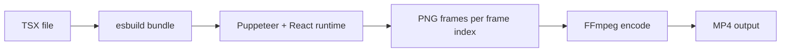

# TSX Composition Authoring

Seqvio renders **handwritten React/TSX** compositions to MP4, similar to Remotion. There is no JSON storyboard or template auto-layout layer.

## Quick start

1. Create a `.tsx` file under `examples/compositions/` or your project.
2. Export a default component and `meta`.
3. Build and render:

```bash
cd seqvio
npm run build
cd packages/renderer
node dist/cli.js \
  --component ../../examples/compositions/seqvio-intro.tsx \
  --output ../../output/my-video.mp4 \
  --width 1280 --height 720 --fps 30 --quality medium
```

## File contract

| Export | Required | Purpose |
|--------|----------|---------|
| `default` | Yes | Root scene or `VideoComposition` |
| `meta` | Yes | `{ duration: frames, fps: number }` for the renderer |

Imports resolve via esbuild aliases:

- `@seqvio/whiteboard`
- `@seqvio/core`

## Single-scene layout

Use one `WhiteboardScene` per file. Place `DrawText`, `DrawShape`, `DrawImage`, and `Hand` as children.

Timing uses **frames**, not seconds:

- `start`: first frame (within the scene) when the element animates
- `duration`: how long the draw animation runs

Centered text: `position={{ x: width / 2, y: ... }}` with `align="center"`.

## Multi-scene layout

Use `VideoComposition` from `@seqvio/core`:

```tsx
<VideoComposition id="intro" width={1280} height={720} fps={30} duration={360}>
  <Scene id="title" duration={72}>
    <TitleScene />
  </Scene>
  <Transition type="fade" duration={12} />
  <Scene id="pipeline" duration={105}>
    <PipelineScene />
  </Scene>
</VideoComposition>
```

Each scene component wraps its own `WhiteboardScene`. Element `start`/`duration` are **local to that scene**.

### Single pen (default)

`WhiteboardScene` enables **`singlePen` by default** (`singlePen={true}`): only one `DrawText` / `DrawShape` stroke animates at a time. Later draws wait until the previous stroke finishes, even if their authored `start` overlaps.

- Order: lower `start` first; ties break by mount order (`order` in registry).
- `start` still means “not before this frame” — idle gaps are allowed.
- Set `singlePen={false}` to restore overlapping authored timelines.
- Scene `duration` must cover the **serialized** end: sum of draw durations (plus any `start` gaps). Use `getSerializedSceneEnd()` from `@seqvio/whiteboard` when planning.

Supported transitions (MVP): `fade`, `slide`, `wipe`, and others defined in `packages/core/src/transitions.ts`.

## Examples

| Path | Description |
|------|-------------|
| `examples/compositions/seqvio-intro.tsx` | 4-scene product intro |
| `packages/core/examples/multi-scene-demo.tsx` | Scene + fade transition API |
| `packages/whiteboard/examples/01-hello-world.tsx` | Minimal single scene |
| `packages/whiteboard/examples/04-framework-intro.tsx` | Long single-scene intro |

## Whiteboard theme (refined defaults)

`WhiteboardScene` wraps children in a **theme context** with refined whiteboard defaults:

- Paper background `#f8f9fb` with subtle line texture
- `DrawText` default `textRender: 'fill'` — solid glyphs revealed LTR (pen-synced clip); use `stroke` / `stroke-wash` for outline styles
- `DrawShape` `rounded-rectangle` with optional light fill wash on cards
- CJK text uses bundled **Noto Sans SC** paths; Latin uses **DejaVu Sans**

Override per scene:

```tsx
<WhiteboardScene theme={{ textRender: 'stroke', colors: { accent: '#e74c3c' } }}>
```

### Excalidraw-style lines (roughjs)

Import `excalidrawTheme` and pass to `WhiteboardScene` — `DrawShape` uses seeded roughjs strokes (stable across frames):

```tsx
import { WhiteboardScene, excalidrawTheme } from '@seqvio/whiteboard';

<WhiteboardScene theme={excalidrawTheme} texture="whiteboard">
```

Or enable per scene: `theme={{ handDrawn: true, roughness: 1.25, bowing: 1.1 }}`.

With `excalidrawTheme` / `handDrawn`: **Virgil** (Latin) and **Long Cang 龙苍** (CJK) as crisp SVG text + clip reveal. Optional CJK **roughjs** via `textRoughness` (> 0). Shapes use full **roughjs**. Without `handDrawn`, text uses Noto/DejaVu opentype paths.

Props:

| Prop | Values | Notes |
|------|--------|-------|
| `textRender` | `fill` \| `stroke` \| `stroke-wash` | On `DrawText`; default solid fill |
| `type` | `rounded-rectangle` | Rounded corners via `borderRadius` |
| `fillColor` | explicit | Overrides theme wash when set |

## CLI reference

```
seqvio-render --component <path.tsx> --output <path.mp4> [options]
```

Options: `--width`, `--height`, `--fps`, `--quality low|medium|high|4k`, `--pixelRatio 1|2` (default **2** for sharper strokes), `--duration`, `--startFrame`, `--endFrame`, `--keepFrames`.

## Rendering pipeline



## What not to use

- `seqvio-render-storyboard` (removed)
- Storyboard JSON with empty `elements` and `kind` templates (removed)
- `npm run validate:storyboard` (removed)

Author layout explicitly in TSX.
