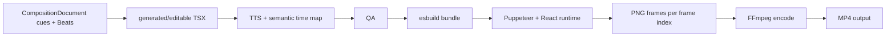

# TSX Composition Authoring

Seqvio renders **React/TSX** compositions to MP4 by mounting them in headless Chromium and capturing one screenshot per frame.

TSX is the final production source: it is what gets bundled, rendered, reviewed, and hand-edited. For new agent-authored technical explainers, the recommended source contract is `CompositionDocument v2`; `seqvio-generate` validates and compiles it into TSX. Storyboard v1 remains a whiteboard-oriented input. Seqvio does not call AI or planner APIs itself.

## Recommended CompositionDocument path

For narrated CompositionDocument scenes, design speech and visuals together in
`explanation`. Do not independently author a scene-level `narration` string and
visual timestamps for the same scene.

```json
{
  "type": "code",
  "id": "request",
  "language": "ts",
  "source": "return api.get('/users');",
  "steps": [
    {
      "id": "request-line",
      "at": 0,
      "action": "focus",
      "range": { "startLine": 1, "endLine": 1 }
    }
  ],
  "explanation": {
    "cues": [
      { "id": "voice", "text": "Now the client sends the request." }
    ],
    "beats": [
      {
        "id": "send-request",
        "cueId": "voice",
        "anchor": { "text": "sends the request" },
        "visuals": [
          { "targetId": "request-line", "action": "focus" }
        ]
      }
    ]
  }
}
```

The compiler first assigns deterministic logical source frames. After TTS,
Seqvio resolves each exact phrase anchor to an `outputFrame` and builds a
scene-local semantic `timeMap`. Whiteboard elements, Code/Diagram steps, and
Terminal/Browser capture evidence all use this contract. See
[`EXPLANATION-BEAT-TIMING.md`](./EXPLANATION-BEAT-TIMING.md) for validation,
scene behavior, confidence, and repair rules.

Hand-authored TSX remains supported below. Direct `meta.audio.narration` is a
lower-level contract and does not automatically provide phrase-level visual
alignment unless the corresponding ExplanationBeat and scene timing metadata
are also present.

## Quick start

1. Create a `.tsx` file under `examples/compositions/` or your project.
2. Export a default component and `meta`.
3. Build and render:

```bash
cd seqvio
npm run build
cd packages/renderer
node dist/cli.js \
  --component ../../examples/compositions/seqvio-intro.tsx \
  --output ../../output/my-video.mp4 \
  --width 1280 --height 720 --fps 30 --quality medium
```

## File contract

| Export | Required | Purpose |
|--------|----------|---------|
| `default` | Yes | Root scene or `VideoComposition` |
| `meta` | Yes | `{ duration: frames, fps: number }` for the renderer |

Imports resolve via esbuild aliases:

- `@seqvio/whiteboard`
- `@seqvio/core`
- `@seqvio/technical`
- `@seqvio/product-demo`
- `@seqvio/scatterbrain`

## Single-scene layout

Use one `WhiteboardScene` per file. Place `DrawText`, `DrawShape`, `DrawImage`, `DrawIcon`, and `Hand` as children.

Timing uses **frames**, not seconds:

- `start`: first frame (within the scene) when the element animates
- `duration`: how long the draw animation runs

Centered text: `position={{ x: width / 2, y: ... }}` with `align="center"`.

## Multi-scene layout

Use `VideoComposition` from `@seqvio/core`:

```tsx
<VideoComposition id="intro" width={1280} height={720} fps={30} duration={360}>
  <Scene id="title" duration={72}>
    <TitleScene />
  </Scene>
  <Transition type="fade" duration={12} />
  <Scene id="pipeline" duration={105}>
    <PipelineScene />
  </Scene>
</VideoComposition>
```

Each scene component wraps its own `WhiteboardScene`. Element `start`/`duration` are **local to that scene**.

### Single pen (default)

`WhiteboardScene` enables **`singlePen` by default** (`singlePen={true}`): only one `DrawText` / `DrawShape` stroke animates at a time. Later draws wait until the previous stroke finishes, even if their authored `start` overlaps.

- Order: lower `start` first; ties break by mount order (`order` in registry).
- `start` still means “not before this frame” — idle gaps are allowed.
- Set `singlePen={false}` to restore overlapping authored timelines.
- Scene `duration` must cover the **serialized** end: sum of draw durations (plus any `start` gaps). Use `getSerializedSceneEnd()` from `@seqvio/whiteboard` when planning.

Supported transitions: `fade`, `slide`, and `wipe` (defined in `packages/core/src/transitions.ts`). Unknown transition names fall back to `fade`.

## Examples

| Path | Description |
|------|-------------|
| `examples/compositions/seqvio-intro.tsx` | 4-scene product intro |
| `packages/core/examples/multi-scene-demo.tsx` | Scene + fade transition API |
| `packages/whiteboard/examples/01-hello-world.tsx` | Minimal single scene |
| `packages/whiteboard/examples/04-framework-intro.tsx` | Long single-scene intro |

## Whiteboard theme (refined defaults)

`WhiteboardScene` wraps children in a **theme context** with refined whiteboard defaults:

- Paper background `#f8f9fb` with subtle line texture
- `DrawText` default `textRender: 'fill'` — solid glyphs revealed LTR (pen-synced clip); use `stroke` / `stroke-wash` for outline styles
- `DrawShape` `rounded-rectangle` with optional light fill wash on cards
- CJK text uses bundled **Noto Sans SC** paths; Latin uses **DejaVu Sans**

Override per scene:

```tsx
<WhiteboardScene theme={{ textRender: 'stroke', colors: { accent: '#e74c3c' } }}>
```

### Excalidraw-style lines (roughjs)

Import `excalidrawTheme` and pass to `WhiteboardScene` — `DrawShape` uses seeded roughjs strokes (stable across frames):

```tsx
import { WhiteboardScene, excalidrawTheme } from '@seqvio/whiteboard';

<WhiteboardScene theme={excalidrawTheme} texture="whiteboard">
```

Or enable per scene: `theme={{ handDrawn: true, roughness: 1.25, bowing: 1.1 }}`.

With `excalidrawTheme` / `handDrawn`: **Virgil** (Latin) and **Long Cang 龙苍** (CJK) as crisp SVG text + clip reveal. Optional CJK **roughjs** via `textRoughness` (> 0). Shapes use full **roughjs**. Without `handDrawn`, text uses Noto/DejaVu opentype paths.

Props:

| Prop | Values | Notes |
|------|--------|-------|
| `textRender` | `fill` \| `stroke` \| `stroke-wash` | On `DrawText`; default solid fill |
| `type` | `rounded-rectangle` | Rounded corners via `borderRadius` |
| `fillColor` | explicit | Overrides theme wash when set |

## CLI reference

```
seqvio-render --component <path.tsx> --output <path.mp4> [options]
```

Options: `--width`, `--height`, `--fps`, `--quality low|medium|high|4k`, `--pixelRatio 1|2` (default **2** for sharper strokes), `--duration`, `--startFrame`, `--endFrame`, `--keepFrames`.

IR helpers:

```bash
seqvio-generate plan-agent --input article.md --write-prompt task.md
seqvio-generate validate --ir storyboard.json --json
seqvio-generate compile --ir storyboard.json --out examples/compositions/generated/storyboard.tsx
```

For `programming`, `ai`, and `devops`, `plan-agent` defaults to
CompositionDocument v2 and asks the host agent to emit ExplanationBeats. Run
audio extraction and synthesis after compilation, then render with the resolved
manifest:

```bash
seqvio-audio extract --component generated.tsx --out output/audio-manifest.json
seqvio-audio synthesize --manifest output/audio-manifest.json --outDir output/audio
seqvio-qa --component generated.tsx --audioManifest output/audio/audio-manifest.resolved.json --profile baseline --ci
seqvio-render --component generated.tsx --audioManifest output/audio/audio-manifest.resolved.json --output output/final.mp4
```

## Rendering pipeline


```mermaid
flowchart LR
  IR[CompositionDocument cues + Beats] --> TSX[generated/editable TSX]
  TSX --> Audio[TTS + semantic time map]
  Audio --> QA[QA]
  QA --> Bundle[esbuild bundle]
  Bundle --> Browser[Puppeteer + React runtime]
  Browser --> Frames[PNG frames per frame index]
  Frames --> FFmpeg[FFmpeg encode]
  FFmpeg --> MP4[MP4 output]
```

## What not to use

- `seqvio-render-storyboard` (removed)
- Seqvio-side automatic planners or template auto-layout (removed)
- `npm run validate:storyboard` (removed)

Use TSX as the editable production source. Use Storyboard IR only as a structured input from a host agent or future editor.
